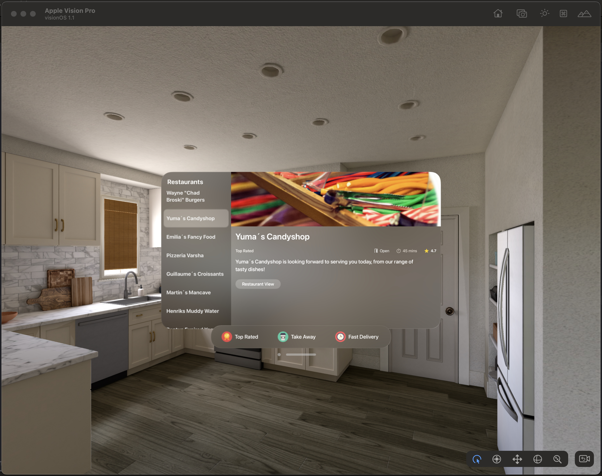

# Restaurant App
- For the Apple Vision Pro

<!---->

## Description
- Presents a list of restaurants, and relevant information about each of them
- A user can see details of the restaurant, e.g. the various tags, rating, and open/closed status on the restaurant's detail page
- [Short Video](https://youtu.be/ycZnTg_MD5s), video length 2:48

## Features
- View a list of restaurants in the left side panel
- Filters are presented in the bottom toolbar
- Details display - restaurant image, name, available tags for the filters, rating and delivery time
- Filter restaurants based on Top-Rated, Take-Away and Fast Delivery
- Sorting of the restaurants, as per their rating and delivery time
- Detail page also indicates open/close status of the restaurant

## Version details for App
- Swift 5
- VisionOS 1.1

## To run the App in Xcode
- Download or clone this project to your Mac
- Open project using Xcode, with VisionOS 1.1 installed in Xcode
- Press the play button in Xcode

### 3D models and Images source
- [Pizza from Sketchfab] (https://sketchfab.com/3d-models/pizza-40d50989fec1460f8838b608d999ccd0)
- [Burger from Sketchfab] (https://sketchfab.com/3d-models/ham-cheese-sandwich-and-crisps-a75c814f56e14de9b0623b8530676110)
- [Restaurant 360 from Adobe Stock] (https://stock.adobe.com/ie/images/minsk-belarus-august-2022-full-spherical-hdri-360-panorama-view-in-banquet-hall-with-table-and-appliances-in-elite-luxury-restaurant-equirectangular-projection-vr-content/545770055?continue-checkout=1&asset_id=545770055)
